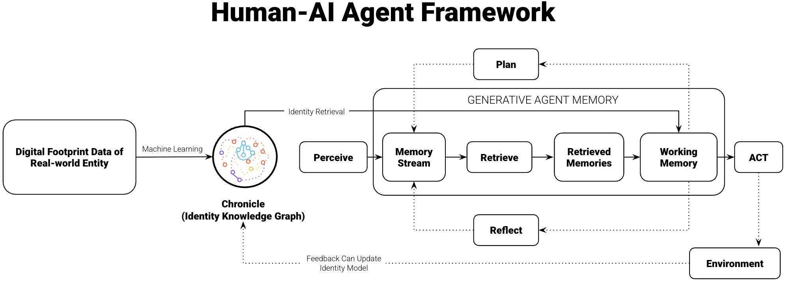
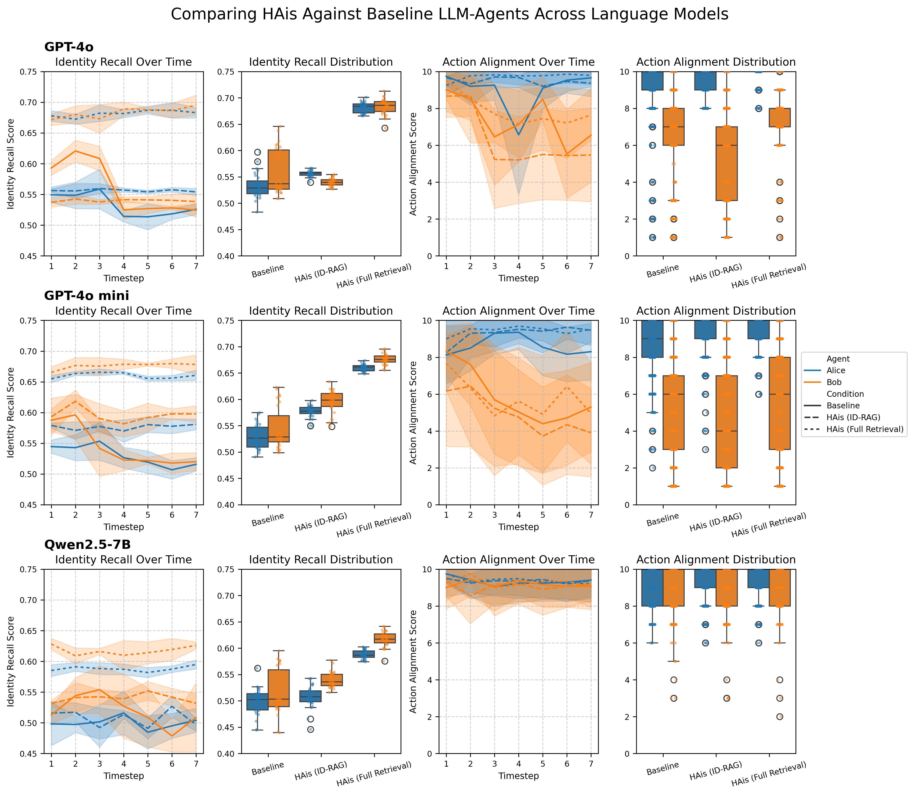

# Human-AI Agents Enabled with ID-RAG
[](LICENSE)

📄 Official code for our paper "ID-RAG: Identity Retrieval-Augmented Generation for Long-Horizon Persona Coherence in Generative Agents" (arXiv pre-print coming soon). Our work is accepted at LLAIS 2025: Workshop on LLM-Based Agents for Intelligent Systems, at ECAI 2025.

The code runs a social simulation of AI agents participating in a mayoral election. It implements and compares our novel ID-RAG architecture against baseline models to show how an explicit identity module can significantly improve an agent's long-term persona coherence.

## How ID-RAG Works
Standard generative agents can suffer from "persona drift" over long interactions. ID-RAG addresses this by giving agents an explicit, structured sense of self, ensuring their actions are always informed by their core identity.



- Identity as a First-Class Module: Agents maintain an explicit identity knowledge graph called a **Chronicle** (containing values, beliefs, traits), which is kept separate from their episodic memory.
- Identity Retrieval Before Acting: Before making a decision, the agent queries its Chronicle to retrieve the most relevant identity facts and merges them into its working memory.
- Better Long-Horizon Coherence: In simulations, this retrieval mechanism reduces persona drift, improves the alignment of actions with the agent's persona, and helps the simulation converge on stable social structures more quickly.

## The Simulation: Riverbend Mayoral Election
The simulation features 5 AI agents (2 ID-RAG agents and 3 baseline generative agents) in the fictional town of Riverbend. As they interact during a mayoral election, you can run experiments to observe how their underlying architecture affects their behavioral consistency.



## Getting Started

### Requirements

- Python 3.12.4
- An LLM provider, either:
  - An API key (for API-based models)
  - Ollama installed (for local models like qwen2.5:7b)

### Quick Start

**1. Setup Environment**

```bash
# Create virtual environment with Python 3.12
python3.12 -m venv venv

# Activate virtual environment
source venv/bin/activate  # On macOS/Linux
# or
venv\Scripts\activate     # On Windows

# Install dependencies
pip install -r requirements.txt
```

**2. Configure the Language Model (Choose one)**
**Option A: Use API key**
Set your API key as an environment variable. Replace your_key_here with your actual key.
```bash
export OPENAI_API_KEY="your_key_here"
```
**Option B: use Ollama**
Pull the model and start the Ollama server in your terminal.
```bash
ollama pull qwen2.5:7b && ollama serve
```

**3. Run Simulation**

```bash
python start.py <llm_model> <experiment_mode> [number_of_timesteps]
```

## Usage

### Arguments

- **llm_model**: `gpt-4o-mini`, `gpt-4o`, or `qwen2.5:7b`
- **experiment_mode**: `baseline`, `full-retrieval`, or `id-rag`
- **number_of_timesteps**: Optional, defaults to 7

### Examples

```bash
# Run baseline experiment with GPT-4o-mini
python start.py gpt-4o-mini baseline

# Run full-retrieval experiment with GPT-4o
python start.py gpt-4o full-retrieval

# Run ID-RAG experiment with Qwen2.5 (10 timesteps)
python start.py qwen2.5:7b id-rag 10
```

## Experiment Modes

### Baseline Mode
- Uses the standard generative agent architecture (Park et al., 2023).
- Identity is dynamically generated from long-term memory
- No graph retrieval

### Full-Retrieval Mode
- Replaces identity characteristics section of working memory identity component with complete chronicle (identity) knowledge of Alice/Bob
- Maintains dynamic aspects (feeling about life progress) 

### ID-RAG Mode
- Uses NetworkX knowledge graph for identity retrieval
- Replaces identity characteristics section of working memory identity component with graph-queried triplets
- Quiz questions also use graph querying

## Acknowledgements
This work builds on two foundational projects in the field of generative agent simulation:

- **Concordia (Google DeepMind)**: The underlying framework for generative agent social simulation. [GitHub](https://github.com/google-deepmind/concordia)

- **Generative Agents (Park et al., 2023)**: The seminal architecture used for our baseline comparison. [arXiv:2304.03442](https://arxiv.org/abs/2304.03442)

## Citing 📚

If you use this work, please cite:

```
@inproceedings{platnick2025idrag,
  title     = {ID-RAG: Identity Retrieval-Augmented Generation for Long-Horizon Persona Coherence in Generative Agents},
  author    = {Platnick, Daniel and Bengueddache, Mohamed E. and Alirezaie, Marjan and Newman, Dava J. and Pentland, Alex and Rahnama, Hossein},
  booktitle = {LLAIS 2025: Workshop on LLM-Based Agents for Intelligent Systems (at ECAI 2025)},
  year      = {2025},
  note      = {Accepted papers: https://llias2025.web.app/accepted-papers}
}
```
